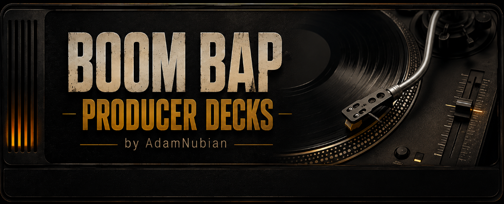

# Changelog

All notable changes to this project are documented here.
Format follows [Keep a Changelog](https://keepachangelog.com/), versioning
follows [Semantic Versioning](https://semver.org/).

## [0.3.0] - 2026-08-09

### Added
- Loop — hit Loop to grab a fixed length (4/8/16/32 beats) from wherever
  the track currently is, using its detected BPM
- Stutter/Repeater — hold to rapidly retrigger a short slice of the
  track, release to resume normal playback; rate is customizable (1/4,
  1/8, 1/16, 1/32 note)
- Letting go of the platter after a scratch now spins the speed back up
  (or down to a stop) over a fraction of a second instead of snapping
  instantly, for a more realistic feel

### Changed
- New app icon — two overlapping platters with a crossfader between
  them, replacing the original single-ring vinyl-groove design

## [0.2.0] - 2026-08-08

### Added
- Project state persistence — loaded files, pitch/volume/EQ/filter/
  reverb, the crossfader, and scratch-strip FX all save and restore
  with your project automatically
- Presets — save/load/delete named presets independent of any DAW
  project, from the new preset bar under the banner

## [0.1.0] - 2026-08-08

First release.

### Added
- Two independent decks — load a sample, play/pause/cue, click-drag the
  platter to scratch
- Auto BPM + key detection on load, plus a Sync button per deck to
  match your host's tempo
- Per-deck mixer: 3-band EQ, a bipolar low/high-pass filter sweep, and
  a reverb send
- Scratch-strip FX — a shared Echo/Delay/Phaser/Reverb/Flanger/Filter
  effect with a Mix knob, applied to the whole mix
- 16 one-shot trigger pads per deck — drag-drop to load, click to
  trigger, self-choke on retrigger
- Equal-power crossfader between the two decks
- Standalone app alongside the VST3 plugin
- App icon for both the standalone app and the installed VST3
